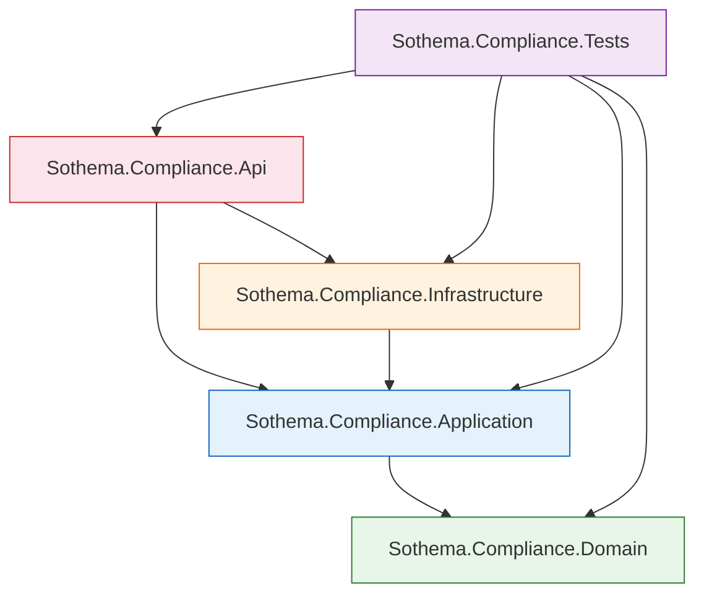

# Backend .NET API — Implementation Plan

## SharePoint + Entra ID Integration

> **TL;DR** — Build the ASP.NET Core 8 backend as a Clean Architecture solution with four projects. The API authenticates users via Microsoft Entra ID (JWT bearer), accesses SharePoint through Microsoft Graph using both delegated (OBO) and app-only (client-credentials) flows, stores metadata/audit data in SQL Server (Docker), and exposes endpoints consumed by the React frontend and the Python AI service. Every step below produces a compilable, runnable increment.

---

## Table of Contents

- [Architecture Alignment](#architecture-alignment)
- [Step 0 — Solution & Project Scaffolding](#step-0--solution--project-scaffolding)
- [Step 1 — Domain Layer](#step-1--domain-layer)
- [Step 2 — Application Layer](#step-2--application-layer)
- [Step 3 — Infrastructure Layer](#step-3--infrastructure-layer)
- [Step 4 — API Layer](#step-4--api-layer)
- [Step 5 — Docker & Local Dev](#step-5--docker--local-dev)
- [Step 6 — Entra ID App Registration](#step-6--entra-id-app-registration)
- [Step 7 — Database Seeding & Initial Migration](#step-7--database-seeding--initial-migration)
- [Key Decisions](#key-decisions)
- [Verification Plan](#verification-plan)

---

## Architecture Alignment

This plan implements the **Backend API Layer** as described in [`architecture.md`](file:///Users/mac/Desktop/sothema-ai-compliance-platform/docs/architecture.md). It acts as the central orchestration layer, responsible for:

- Handling HTTP requests from the React frontend
- Validating Entra ID authentication tokens
- Managing user roles (Admin, Analyst, Viewer)
- Communicating with the Python AI service (FastAPI)
- Retrieving documents from SharePoint via Microsoft Graph API
- Managing compliance data and audit logs in SQL Server

```
User → Frontend (React) → ASP.NET Core API → Microsoft Graph API → SharePoint
                                            → Python AI Service (FastAPI)
                                            → SQL Server
```

---

## Step 0 — Solution & Project Scaffolding

### Goal

Create the solution file and four class-library/web projects inside `backend-dotnet-api/`.

### Target Structure

```
backend-dotnet-api/
├── Sothema.Compliance.sln
├── Directory.Build.props
├── .editorconfig
├── src/
│   ├── Sothema.Compliance.Domain/          (Class Library — net8.0)
│   ├── Sothema.Compliance.Application/     (Class Library — net8.0)
│   ├── Sothema.Compliance.Infrastructure/  (Class Library — net8.0)
│   └── Sothema.Compliance.Api/             (ASP.NET Core Web API — net8.0)
└── tests/
    └── Sothema.Compliance.Tests/           (xUnit — net8.0)
```

### Project References

| From | To |
|---|---|
| `Api` | `Application`, `Infrastructure` |
| `Infrastructure` | `Application` |
| `Application` | `Domain` |
| `Tests` | `Api`, `Application`, `Domain`, `Infrastructure` |

### Files to Create

| File | Purpose |
|---|---|
| `Sothema.Compliance.sln` | Root solution file |
| `Directory.Build.props` | Enforce `net8.0`, `Nullable`, `ImplicitUsings`, treat warnings as errors |
| `.editorconfig` | Consistent code style (indent, naming conventions, etc.) |

### Commands

```bash
# Create solution
dotnet new sln -n Sothema.Compliance -o backend-dotnet-api

# Create projects
dotnet new classlib -n Sothema.Compliance.Domain -o backend-dotnet-api/src/Sothema.Compliance.Domain
dotnet new classlib -n Sothema.Compliance.Application -o backend-dotnet-api/src/Sothema.Compliance.Application
dotnet new classlib -n Sothema.Compliance.Infrastructure -o backend-dotnet-api/src/Sothema.Compliance.Infrastructure
dotnet new webapi -n Sothema.Compliance.Api -o backend-dotnet-api/src/Sothema.Compliance.Api --no-openapi
dotnet new xunit -n Sothema.Compliance.Tests -o backend-dotnet-api/tests/Sothema.Compliance.Tests

# Add projects to solution
dotnet sln backend-dotnet-api/Sothema.Compliance.sln add \
  backend-dotnet-api/src/Sothema.Compliance.Domain/Sothema.Compliance.Domain.csproj \
  backend-dotnet-api/src/Sothema.Compliance.Application/Sothema.Compliance.Application.csproj \
  backend-dotnet-api/src/Sothema.Compliance.Infrastructure/Sothema.Compliance.Infrastructure.csproj \
  backend-dotnet-api/src/Sothema.Compliance.Api/Sothema.Compliance.Api.csproj \
  backend-dotnet-api/tests/Sothema.Compliance.Tests/Sothema.Compliance.Tests.csproj

# Add project references
dotnet add backend-dotnet-api/src/Sothema.Compliance.Application reference backend-dotnet-api/src/Sothema.Compliance.Domain
dotnet add backend-dotnet-api/src/Sothema.Compliance.Infrastructure reference backend-dotnet-api/src/Sothema.Compliance.Application
dotnet add backend-dotnet-api/src/Sothema.Compliance.Api reference backend-dotnet-api/src/Sothema.Compliance.Application
dotnet add backend-dotnet-api/src/Sothema.Compliance.Api reference backend-dotnet-api/src/Sothema.Compliance.Infrastructure
dotnet add backend-dotnet-api/tests/Sothema.Compliance.Tests reference backend-dotnet-api/src/Sothema.Compliance.Api
dotnet add backend-dotnet-api/tests/Sothema.Compliance.Tests reference backend-dotnet-api/src/Sothema.Compliance.Application
dotnet add backend-dotnet-api/tests/Sothema.Compliance.Tests reference backend-dotnet-api/src/Sothema.Compliance.Domain
dotnet add backend-dotnet-api/tests/Sothema.Compliance.Tests reference backend-dotnet-api/src/Sothema.Compliance.Infrastructure
```

> [!NOTE]
> All projects target `net8.0` (LTS). `Directory.Build.props` centralizes common settings to avoid duplication across `.csproj` files.

---

## Step 1 — Domain Layer

### Project: `Sothema.Compliance.Domain`

**Zero external dependencies** — pure C# entities, enums, and interfaces.

### Enums

| Enum | Values |
|---|---|
| `AnalysisStatus` | `Pending`, `Processing`, `Completed`, `Failed` |
| `UserRole` | `Admin`, `Analyst`, `Viewer` |

### Entities

#### `Document`

| Property | Type | Notes |
|---|---|---|
| `Id` | `Guid` | Primary key |
| `SharePointItemId` | `string` | SharePoint item identifier (indexed) |
| `Title` | `string` | Document title |
| `SiteId` | `string` | SharePoint site ID |
| `DriveId` | `string` | SharePoint drive ID |
| `ContentType` | `string` | MIME type |
| `FileType` | `string` | Extension/type used by ingestion pipeline |
| `SharePointUrl` | `string` | Direct SharePoint URL |
| `UploadedAt` | `DateTime` | UTC timestamp |

Navigation properties:
- `ICollection<TextSegment> TextSegments`
- `ICollection<ComplianceAnalysis> ComplianceAnalyses`

#### `TextSegment`

| Property | Type | Notes |
|---|---|---|
| `Id` | `Guid` | Primary key |
| `DocumentId` | `Guid` | FK → Document |
| `Content` | `string` | Chunk text |
| `ChunkIndex` | `int` | Order within source document |
| `VectorStoreId` | `string?` | Bridge ID to FAISS/BM25 index |
| `CreatedAt` | `DateTime` | UTC timestamp |

Navigation properties:
- `Document Document`
- `ICollection<AiRequestSegment> AiRequestSegments`

#### `ComplianceAnalysis`

| Property | Type | Notes |
|---|---|---|
| `Id` | `Guid` | Primary key |
| `DocumentId` | `Guid` | FK → Document |
| `Score` | `double` | Compliance score (0–100) |
| `Summary` | `string` | AI-generated summary |
| `Details` | `string?` | JSON details payload |
| `AnalyzedAt` | `DateTime` | UTC timestamp |
| `Status` | `AnalysisStatus` | Current analysis state |

Navigation properties:
- `Document Document`

#### `AuditLog`

| Property | Type | Notes |
|---|---|---|
| `Id` | `Guid` | Primary key |
| `UserId` | `string` | Entra ID object ID |
| `Action` | `string` | Action performed |
| `EntityType` | `string` | Target entity type |
| `EntityId` | `string` | Target entity ID |
| `Timestamp` | `DateTime` | UTC timestamp |
| `Details` | `string?` | JSON serialized details |

#### `User`

| Property | Type | Notes |
|---|---|---|
| `Id` | `Guid` | Primary key |
| `EntraObjectId` | `string` | Entra ID OID (indexed) |
| `DisplayName` | `string` | User display name |
| `Email` | `string` | User email |
| `Role` | `UserRole` | User role |
| `CreatedAt` | `DateTime` | UTC timestamp |

Navigation properties:
- `ICollection<UserQuery> Queries`

#### `Agent`

| Property | Type | Notes |
|---|---|---|
| `Id` | `Guid` | Primary key |
| `Name` | `string` | Agent display name |
| `TaskType` | `string` | Agent specialization/task category |
| `IsActive` | `bool` | Whether agent is active |

Navigation properties:
- `ICollection<UserQuery> ProcessedQueries`

#### `UserQuery`

| Property | Type | Notes |
|---|---|---|
| `Id` | `Guid` | Primary key |
| `UserId` | `Guid` | FK → User |
| `Question` | `string` | User input/query text |
| `Response` | `string?` | Optional response text |
| `AgentId` | `Guid?` | Optional FK → Agent |
| `CreatedAt` | `DateTime` | UTC timestamp |

Navigation properties:
- `User User`
- `Agent? Agent`

#### `AiRequest`

| Property | Type | Notes |
|---|---|---|
| `Id` | `Guid` | Primary key |
| `UserQueryId` | `Guid?` | Optional FK → UserQuery |
| `Question` | `string` | Prompt sent to AI subsystem |
| `Response` | `string?` | Optional AI response text |
| `CreatedAt` | `DateTime` | UTC timestamp |

Navigation properties:
- `UserQuery? UserQuery`
- `ICollection<AiRequestSegment> ContextSegments`

#### `AiRequestSegment`

| Property | Type | Notes |
|---|---|---|
| `AiRequestId` | `Guid` | Composite PK part, FK → AiRequest |
| `TextSegmentId` | `Guid` | Composite PK part, FK → TextSegment |
| `RelevanceScore` | `double?` | Optional retrieval score |

Navigation properties:
- `AiRequest AiRequest`
- `TextSegment TextSegment`

### Repository Interfaces

```csharp
IRepository<T>
IDocumentRepository
ITextSegmentRepository
IComplianceAnalysisRepository
IAuditLogRepository
IUserRepository
IAgentRepository
IUserQueryRepository
IAiRequestRepository
```

`IRepository<T>` defines shared async CRUD:
- `GetByIdAsync(Guid id, CancellationToken ct = default)`
- `GetAllAsync(CancellationToken ct = default)`
- `AddAsync(T entity, CancellationToken ct = default)`
- `UpdateAsync(T entity, CancellationToken ct = default)`
- `DeleteAsync(T entity, CancellationToken ct = default)`

Specialized repositories extend the base interface with domain-specific queries, for example:
- `IDocumentRepository.GetBySharePointItemIdAsync(...)`
- `ITextSegmentRepository.GetByDocumentIdAsync(...)`
- `IComplianceAnalysisRepository.GetByDocumentIdAsync(...)`
- `IAuditLogRepository.GetByEntityAsync(...)`
- `IUserRepository.GetByEntraObjectIdAsync(...)`
- `IAgentRepository.GetByTaskTypeAsync(...)`
- `IUserQueryRepository.GetByUserIdAsync(...)`
- `IAiRequestRepository.GetByUserQueryIdAsync(...)`

### File Structure

```
Sothema.Compliance.Domain/
├── Entities/
│   ├── Agent.cs
│   ├── AiRequest.cs
│   ├── AiRequestSegment.cs
│   ├── AuditLog.cs
│   ├── ComplianceAnalysis.cs
│   ├── Document.cs
│   ├── TextSegment.cs
│   ├── User.cs
│   └── UserQuery.cs
├── Enums/
│   ├── AnalysisStatus.cs
│   └── UserRole.cs
└── Interfaces/
    ├── IAgentRepository.cs
    ├── IAiRequestRepository.cs
    ├── IAuditLogRepository.cs
    ├── IComplianceAnalysisRepository.cs
    ├── IDocumentRepository.cs
    ├── IRepository.cs
    ├── ITextSegmentRepository.cs
    ├── IUserQueryRepository.cs
    └── IUserRepository.cs
```

---

## Step 2 — Application Layer

### Project: `Sothema.Compliance.Application`

### NuGet Packages

| Package | Purpose |
|---|---|
| `MediatR` | CQRS command/query dispatching |
| `FluentValidation` | Input validation |
| `FluentValidation.DependencyInjectionExtensions` | Auto-registration |
| `AutoMapper` | Entity ↔ DTO mapping |

### Service Interfaces

| Interface | Purpose |
|---|---|
| `ISharePointService` | SharePoint/Graph interaction |
| `IAiService` | Python AI service communication |
| `ICurrentUserService` | Read authenticated user claims |

### DTOs

| DTO | Used For |
|---|---|
| `DocumentDto` | Document list/detail responses |
| `ComplianceResultDto` | Analysis result responses |
| `AuditLogDto` | Audit trail responses |
| `UserProfileDto` | Current user profile |
| `SharePointSearchResultDto` | SharePoint search results |

### CQRS Features (MediatR)

#### Documents

| Feature | Type | Description |
|---|---|---|
| `GetDocumentsQuery` | Query | Paginated list from DB |
| `GetDocumentByIdQuery` | Query | Single document detail |
| `SearchDocumentsQuery` | Query | Search SharePoint via Graph |
| `GetDocumentContentQuery` | Query | Download content from SharePoint |
| `IngestDocumentCommand` | Command | Fetch from SharePoint, trigger AI processing |

#### Compliance

| Feature | Type | Description |
|---|---|---|
| `GetAnalysisQuery` | Query | Fetch analysis result |
| `RequestAnalysisCommand` | Command | Trigger AI analysis |

#### Audit Logs

| Feature | Type | Description |
|---|---|---|
| `GetAuditLogsQuery` | Query | Paginated, filterable audit trail |

### Pipeline Behaviors

| Behavior | Purpose |
|---|---|
| `ValidationBehavior<TRequest, TResponse>` | Runs FluentValidation validators before handler |
| `AuditBehavior<TRequest, TResponse>` | Auto-logs every command to audit trail |

### File Structure

```
Sothema.Compliance.Application/
├── Common/
│   ├── Behaviors/
│   │   ├── ValidationBehavior.cs
│   │   └── AuditBehavior.cs
│   ├── Interfaces/
│   │   ├── ISharePointService.cs
│   │   ├── IAiService.cs
│   │   └── ICurrentUserService.cs
│   ├── Mappings/
│   │   └── MappingProfile.cs
│   └── Models/
│       ├── PaginatedList.cs
│       └── Result.cs
├── DTOs/
│   ├── DocumentDto.cs
│   ├── ComplianceResultDto.cs
│   ├── AuditLogDto.cs
│   ├── UserProfileDto.cs
│   └── SharePointSearchResultDto.cs
├── Features/
│   ├── Documents/
│   │   ├── Queries/
│   │   │   ├── GetDocumentsQuery.cs
│   │   │   ├── GetDocumentByIdQuery.cs
│   │   │   ├── SearchDocumentsQuery.cs
│   │   │   └── GetDocumentContentQuery.cs
│   │   └── Commands/
│   │       └── IngestDocumentCommand.cs
│   ├── Compliance/
│   │   ├── Queries/
│   │   │   └── GetAnalysisQuery.cs
│   │   └── Commands/
│   │       └── RequestAnalysisCommand.cs
│   └── AuditLogs/
│       └── Queries/
│           └── GetAuditLogsQuery.cs
└── DependencyInjection.cs
```

---

## Step 3 — Infrastructure Layer

### Project: `Sothema.Compliance.Infrastructure`

### NuGet Packages

| Package | Purpose |
|---|---|
| `Microsoft.EntityFrameworkCore.SqlServer` | SQL Server provider |
| `Microsoft.EntityFrameworkCore.Design` | Migrations tooling |
| `Microsoft.Identity.Web` | Entra ID token validation |
| `Microsoft.Identity.Web.MicrosoftGraph` | Graph SDK integration |
| `Microsoft.Graph` | SharePoint access |

### 3a. Persistence

#### `ComplianceDbContext`

- `DbSet<Document>`, `DbSet<ComplianceAnalysis>`, `DbSet<AuditLog>`, `DbSet<User>`
- Fluent API configurations in separate files under `Persistence/Configurations/`

#### Entity Configurations (Fluent API)

| Entity | Key Indexes |
|---|---|
| `Document` | Index on `SharePointItemId` |
| `ComplianceAnalysis` | Composite index on `[DocumentId, AnalyzedAt]` |
| `User` | Unique index on `EntraObjectId` |
| `AuditLog` | Index on `[EntityType, EntityId]`, index on `Timestamp` |

#### Repository Implementations

- `DocumentRepository : IDocumentRepository`
- `ComplianceAnalysisRepository : IComplianceAnalysisRepository`
- `AuditLogRepository : IAuditLogRepository`
- `UserRepository : IUserRepository`

### 3b. SharePoint / Microsoft Graph Service

`SharePointService : ISharePointService`

| Method | Flow | Description |
|---|---|---|
| `SearchDocumentsAsync(query)` | Delegated (OBO) | Search SharePoint using Graph `/search/query` |
| `GetDocumentContentAsync(driveId, itemId)` | Delegated (OBO) | Download document content stream |
| `ListDocumentsInFolderAsync(siteId, folderId)` | App-only | List documents for background ingestion |
| `GetDocumentMetadataAsync(itemId)` | Delegated (OBO) | Get document metadata |

> [!IMPORTANT]
> **Delegated (OBO) flow** is used for user-facing requests to respect per-user SharePoint permissions.
> **App-only (client-credentials) flow** is used for background ingestion jobs with no user context.

### 3c. AI Service Client

`AiServiceClient : IAiService` — typed `HttpClient`

| Method | HTTP | AI Service Endpoint |
|---|---|---|
| `RequestAnalysisAsync(documentContent)` | POST | `/api/analyze` |
| `GetAnalysisStatusAsync(jobId)` | GET | `/api/analyze/{jobId}/status` |
| `SearchSimilarDocumentsAsync(query)` | POST | `/api/search` |

Configuration: `AiService:BaseUrl` in `appsettings.json`.

### 3d. Current User Service

`CurrentUserService : ICurrentUserService`

Reads from `HttpContext.User` claims:
- `oid` → Entra Object ID
- `name` → Display Name
- `preferred_username` → Email
- `roles` → App Roles

### 3e. Dependency Injection

`DependencyInjection.cs` — extension method `AddInfrastructure(this IServiceCollection, IConfiguration)`:

- Registers `ComplianceDbContext` with SQL Server connection string
- Registers all repository implementations
- Configures `GraphServiceClient` with Microsoft Identity Web
- Registers `AiServiceClient` as a typed HttpClient
- Registers `CurrentUserService`

### File Structure

```
Sothema.Compliance.Infrastructure/
├── Persistence/
│   ├── ComplianceDbContext.cs
│   ├── Configurations/
│   │   ├── DocumentConfiguration.cs
│   │   ├── ComplianceAnalysisConfiguration.cs
│   │   ├── AuditLogConfiguration.cs
│   │   └── UserConfiguration.cs
│   └── Repositories/
│       ├── DocumentRepository.cs
│       ├── ComplianceAnalysisRepository.cs
│       ├── AuditLogRepository.cs
│       └── UserRepository.cs
├── Services/
│   ├── SharePointService.cs
│   ├── AiServiceClient.cs
│   └── CurrentUserService.cs
├── DependencyInjection.cs
└── Migrations/
    └── (generated by EF Core)
```

---

## Step 4 — API Layer

### Project: `Sothema.Compliance.Api`

### NuGet Packages

| Package | Purpose |
|---|---|
| `Microsoft.Identity.Web` | Entra ID JWT bearer authentication |
| `Microsoft.Identity.Web.UI` | OAuth consent UI (Swagger) |
| `Swashbuckle.AspNetCore` | Swagger/OpenAPI |
| `Serilog.AspNetCore` | Structured logging |
| `Serilog.Sinks.Console` | Console log output |
| `Serilog.Sinks.File` | File log output |

### 4a. Authentication & Authorization

**`Program.cs`** configuration:

1. `AddMicrosoftIdentityWebApiAuthentication(Configuration)` — JWT bearer validation against Entra ID
2. `EnableTokenAcquisitionToCallDownstreamApi()` + `AddMicrosoftGraph()` — OBO flow for Graph
3. Authorization policies:

| Policy | Rule |
|---|---|
| `RequireAdmin` | Role claim = `Admin` |
| `RequireAnalyst` | Role claim ∈ {`Admin`, `Analyst`} |
| Default | Any authenticated user |

### 4b. Controllers

| Controller | Endpoints | Auth |
|---|---|---|
| `DocumentsController` | `GET /api/documents` — paginated list | Authenticated |
| | `GET /api/documents/{id}` — document detail | Authenticated |
| | `GET /api/documents/search?q=` — SharePoint search | Authenticated |
| | `GET /api/documents/{id}/content` — download | Authenticated |
| | `POST /api/documents/ingest` — trigger ingestion | Analyst |
| `ComplianceController` | `POST /api/compliance/analyze` — trigger analysis | Analyst |
| | `GET /api/compliance/{analysisId}` — analysis result | Authenticated |
| `AuditController` | `GET /api/audit` — paginated audit logs | Admin |
| `UsersController` | `GET /api/users/me` — current user profile | Authenticated |
| `HealthController` | `GET /api/health` — health check | Anonymous |

> [!NOTE]
> All controllers delegate to MediatR handlers — **zero business logic** in the controller layer.

### 4c. Middleware & Cross-Cutting

| Component | Purpose |
|---|---|
| `GlobalExceptionHandlerMiddleware` | Catches unhandled exceptions, returns `ProblemDetails` |
| `CorrelationIdMiddleware` | Propagates a `X-Correlation-Id` header for distributed tracing |
| **Serilog** | Structured logging with console + file sinks |
| **CORS Policy** | Allows the React frontend origin |
| **Swagger/OpenAPI** | OAuth2 authorization code flow for testing in Swagger UI |

### 4d. Configuration

`appsettings.json` sections:

```jsonc
{
  "AzureAd": {
    "Instance": "https://login.microsoftonline.com/",
    "TenantId": "<tenant-id>",
    "ClientId": "<client-id>",
    "ClientSecret": "<client-secret>",  // use user-secrets in dev
    "CallbackPath": "/signin-oidc",
    "Scopes": "https://graph.microsoft.com/.default"
  },
  "ConnectionStrings": {
    "DefaultConnection": "Server=localhost,1433;Database=SothemaCompliance;User Id=sa;Password=<password>;TrustServerCertificate=true"
  },
  "AiService": {
    "BaseUrl": "http://localhost:8000"
  },
  "SharePoint": {
    "SiteId": "<site-id>",
    "DriveId": "<drive-id>"
  }
}
```

### File Structure

```
Sothema.Compliance.Api/
├── Controllers/
│   ├── DocumentsController.cs
│   ├── ComplianceController.cs
│   ├── AuditController.cs
│   ├── UsersController.cs
│   └── HealthController.cs
├── Middleware/
│   ├── GlobalExceptionHandlerMiddleware.cs
│   └── CorrelationIdMiddleware.cs
├── Program.cs
├── appsettings.json
├── appsettings.Development.json
└── Dockerfile
```

---

## Step 5 — Docker & Local Dev

### Docker Compose

Add to `docker/docker-compose.yml`:

```yaml
services:
  sqlserver:
    image: mcr.microsoft.com/mssql/server:2022-latest
    environment:
      ACCEPT_EULA: "Y"
      SA_PASSWORD: "${SA_PASSWORD}"
    ports:
      - "1433:1433"
    volumes:
      - sqlserver-data:/var/opt/mssql

  backend-api:
    build:
      context: ../backend-dotnet-api
      dockerfile: src/Sothema.Compliance.Api/Dockerfile
    ports:
      - "5000:8080"
    environment:
      - ConnectionStrings__DefaultConnection=Server=sqlserver,1433;Database=SothemaCompliance;User Id=sa;Password=${SA_PASSWORD};TrustServerCertificate=true
      - AzureAd__ClientSecret=${AZURE_AD_CLIENT_SECRET}
      - AiService__BaseUrl=http://ai-service:8000
    depends_on:
      - sqlserver

volumes:
  sqlserver-data:
```

### Dockerfile

Multi-stage build in `backend-dotnet-api/src/Sothema.Compliance.Api/Dockerfile`:

```dockerfile
# Build stage
FROM mcr.microsoft.com/dotnet/sdk:8.0 AS build
WORKDIR /src
COPY . .
RUN dotnet restore Sothema.Compliance.sln
RUN dotnet publish src/Sothema.Compliance.Api/Sothema.Compliance.Api.csproj -c Release -o /app/publish

# Runtime stage
FROM mcr.microsoft.com/dotnet/aspnet:8.0
WORKDIR /app
COPY --from=build /app/publish .
EXPOSE 8080
ENTRYPOINT ["dotnet", "Sothema.Compliance.Api.dll"]
```

### Environment File

`docker/.env.example`:

```env
SA_PASSWORD=YourStrong!Passw0rd
AZURE_AD_CLIENT_SECRET=your-client-secret-here
```

---

## Step 6 — Entra ID App Registration

> [!IMPORTANT]
> This is a **manual step** performed in the Azure Portal. A separate guide will be created at `docs/entra-id-setup.md`.

### Steps to Document

1. **Register an app** in Microsoft Entra ID → note `ClientId`, `TenantId`
2. **Add API permissions**:
   - `Microsoft Graph` → `Sites.Read.All` (delegated + application)
   - `Microsoft Graph` → `Files.Read.All` (delegated + application)
3. **Create a client secret** → store in user-secrets / `.env`
4. **Expose an API**:
   - Set `Application ID URI`
   - Add scope: `access_as_user`
5. **Configure the React SPA** as a known client application
6. **Define App Roles**:
   - `Admin` — full access
   - `Analyst` — can trigger analyses
   - `Viewer` — read-only
   - Assign roles to users/groups in Entra ID

---

## Step 7 — Database Seeding & Initial Migration

### DbInitializer

- Seeds default admin user and sample data in `Development` environment only
- Called from `Program.cs` during app startup

### Migration Commands

```bash
# Install EF Core tools (if not installed)
dotnet tool install --global dotnet-ef

# Create initial migration
dotnet ef migrations add InitialCreate \
  --project src/Sothema.Compliance.Infrastructure \
  --startup-project src/Sothema.Compliance.Api

# Apply migration to Docker SQL Server
dotnet ef database update \
  --project src/Sothema.Compliance.Infrastructure \
  --startup-project src/Sothema.Compliance.Api
```

---

## Key Decisions

| Decision | Rationale |
|---|---|
| **Clean Architecture (4 projects)** | Keeps domain logic independent of infrastructure; testable and aligned with enterprise scale |
| **.NET 8 LTS** | Long-term support, stable for enterprise deployment |
| **Both OBO + client-credentials flows** | OBO for user-facing requests (respects SharePoint per-user permissions), client-credentials for background jobs |
| **MediatR + CQRS** | Decouples controllers from business logic; makes audit pipeline behavior easy to inject |
| **SQL Server in Docker** | Matches the architecture doc with zero local install friction |
| **Microsoft.Identity.Web + Graph SDK** | Microsoft's recommended libraries for Entra ID and Graph in ASP.NET Core; handles token caching, OBO, and retries |
| **FluentValidation Pipeline** | Centralizes input validation, keeps handlers clean |
| **Serilog** | Structured logging with pluggable sinks (console, file, later Seq or Application Insights) |

---

## Verification Plan

### Build Verification

```bash
dotnet build backend-dotnet-api/Sothema.Compliance.sln
```

**Expected**: Zero errors, zero warnings.

### Database Verification

```bash
# Start SQL Server container
docker compose -f docker/docker-compose.yml up -d sqlserver

# Apply migrations
cd backend-dotnet-api
dotnet ef database update \
  --project src/Sothema.Compliance.Infrastructure \
  --startup-project src/Sothema.Compliance.Api
```

**Expected**: All tables (`Documents`, `ComplianceAnalyses`, `AuditLogs`, `Users`) created successfully.

### Application Startup

```bash
cd backend-dotnet-api
dotnet run --project src/Sothema.Compliance.Api
```

**Expected**: Application starts, Swagger UI available at `https://localhost:{port}/swagger`.

### Endpoint Smoke Tests

| Test | Method | URL | Expected |
|---|---|---|---|
| Health check | `GET` | `/api/health` | `200 OK` |
| Auth check | `GET` | `/api/users/me` (with valid token) | `200` with user claims |
| Auth rejection | `GET` | `/api/users/me` (no token) | `401 Unauthorized` |
| SharePoint search | `GET` | `/api/documents/search?q=SOP` (with valid token) | Results from SharePoint |

### Unit Tests

```bash
cd backend-dotnet-api
dotnet test
```

**Test Coverage**:

| Test Area | Approach |
|---|---|
| Repository tests | EF Core in-memory provider |
| MediatR handler tests | Mocked repository + service interfaces |
| Validation behavior tests | FluentValidation with invalid/valid inputs |
| Controller tests | Integration tests with `WebApplicationFactory` |

---

## Dependency Graph



---

## Implementation Order

> Each step produces a compilable, runnable increment.

| Step | Deliverable | Depends On |
|---|---|---|
| **0** | Solution scaffolding, project references, build props | — |
| **1** | Domain entities, enums, repository interfaces | Step 0 |
| **2** | Application DTOs, MediatR features, behaviors, mappings | Step 1 |
| **3** | Infrastructure: DbContext, repositories, services, DI | Step 2 |
| **4** | API: controllers, auth, middleware, Swagger | Step 3 |
| **5** | Docker compose, Dockerfile, `.env` | Step 4 |
| **6** | Entra ID setup documentation | Step 4 |
| **7** | Database seeding, initial migration | Step 3, 5 |

> [!CAUTION]
> **Step 6 (Entra ID App Registration)** requires manual Azure Portal configuration. Without valid `TenantId`, `ClientId`, and `ClientSecret`, authentication-dependent endpoints will return `401`. The health endpoint and build verification work without Entra ID configuration.
