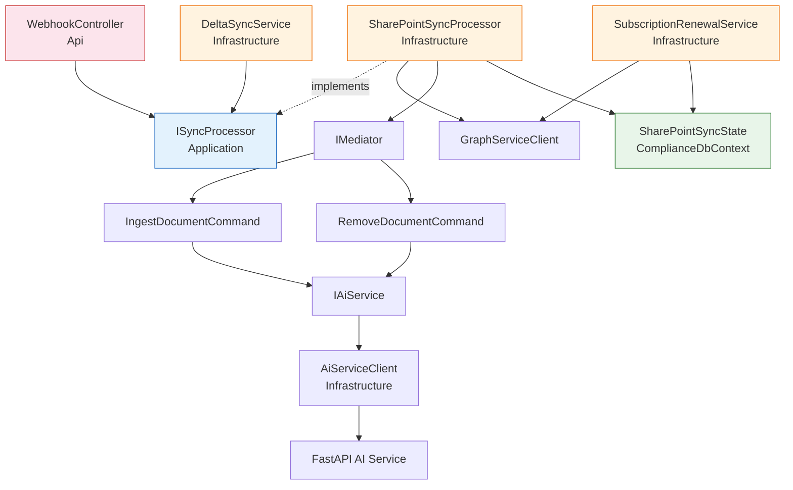

# SharePoint ↔ FAISS/BM25 Synchronization — Implementation Plan

## Hybrid Webhooks + Delta Polling Architecture

> **TL;DR** — Keep the FAISS/BM25 indexes in lock-step with the SharePoint document library using a hybrid strategy: Microsoft Graph **change notifications (webhooks)** as the primary low-latency channel and a **delta polling background service** as the safety net. Both paths funnel into a single `SharePointSyncProcessor` that calls the Graph `/delta` endpoint, classifies each change as added / modified / deleted, and dispatches `IngestDocumentCommand` or `RemoveDocumentCommand` through MediatR. Persistence of the Graph delta token, subscription ID, and subscription expiry lives in a new `SharePointSyncState` entity managed by `ComplianceDbContext`. Every step below produces a compilable, runnable increment and slots directly into the Clean Architecture already defined in [`backend-dotnet-api-implementation-plan.md`](backend-dotnet-api-implementation-plan.md).

---

## Table of Contents

- [Section 1 — Context and Problem Statement](#section-1--context-and-problem-statement)
- [Section 2 — Architecture Decision](#section-2--architecture-decision)
- [Section 3 — New Database Entity](#section-3--new-database-entity)
- [Section 4 — New Components to Implement](#section-4--new-components-to-implement)
- [Section 5 — Processing Logic Detail](#section-5--processing-logic-detail)
- [Section 6 — NuGet Packages Needed](#section-6--nuget-packages-needed)
- [Section 7 — Configuration](#section-7--configuration)
- [Section 8 — Implementation Order](#section-8--implementation-order)
- [Section 9 — Verification Plan](#section-9--verification-plan)

---

## Section 1 — Context and Problem Statement

The Sothema AI Compliance Platform relies on a Hybrid RAG pipeline backed by a FAISS vector index and a BM25 keyword index (see [`ai-service-python-implementation-plan.md`](ai-service-python-implementation-plan.md)). These indexes are populated from documents retrieved from SharePoint via Microsoft Graph. Once a document has been ingested, the text chunks, their embeddings, and the `TextSegment` rows in SQL Server form a frozen snapshot of the source file at ingestion time.

SharePoint is a **live collaborative repository** — SOPs, GMP procedures, audit reports, and ICH / FDA reference documents are continuously added, edited, renamed, superseded, and occasionally deleted by quality and regulatory teams. Without a synchronization mechanism, the indexes become **stale within days**:

| Event in SharePoint | Consequence if Not Synced |
|---|---|
| New SOP uploaded | Analysts search and retrieve **zero hits** for a procedure that exists in the repository |
| SOP revised (v2 replaces v1) | RAG answers cite the **obsolete version**, producing a compliance score against retired requirements |
| Document deleted / superseded | AI answers still reference a document that **no longer exists in the system of record** |

In a GMP pharmaceutical context, any of these failure modes is unacceptable. Regulatory decisions, batch release assessments, and audit responses must be traceable to the **current, authoritative** version of each document. Providing an AI-generated compliance score based on a retired procedure would introduce regulatory risk and undermine the traceability guarantees required by ICH Q10, FDA 21 CFR Part 211, and WHO GMP.

The synchronization subsystem must therefore guarantee that the FAISS / BM25 indexes and the `Documents` / `TextSegments` tables reflect the **current SharePoint state** with **bounded latency** and **no silent gaps**.

---

## Section 2 — Architecture Decision

### Decision — Option 3: Hybrid (Webhooks + Delta Polling)

The chosen architecture combines two mechanisms that both feed the same `SharePointSyncProcessor`:

1. **Primary channel — Microsoft Graph change notifications (webhooks)** delivered to a public endpoint. Near-real-time propagation (seconds to minutes).
2. **Safety net — Delta polling `BackgroundService`** running every 15–30 minutes. Guarantees eventual consistency even if webhooks are missed, the subscription lapses, or the endpoint is unreachable.

Both mechanisms invoke the **same core processing logic written once** in `SharePointSyncProcessor`. The processor, in turn, is the only component that talks to the Graph `/delta` endpoint and persists the delta token.

### Why Not Option 1 (Polling Only)

| Concern | Impact |
|---|---|
| Latency of up to 30 min before a new document is searchable | Poor UX for quality teams who just uploaded a procedure and expect it to be indexed |
| Every poll hits Graph even when nothing changed | Wasteful; contributes to Graph throttling quotas |
| No push signal → cannot trigger immediate re-ingestion on revision | RAG keeps serving obsolete chunks longer than necessary |

### Why Not Option 2 (Webhooks Only)

| Concern | Impact |
|---|---|
| Graph subscriptions expire (max 30 days on drive resources, often shorter in practice) | A single missed renewal silently halts all synchronization |
| Webhook delivery is best-effort — notifications can be dropped on network failure or backend downtime | Undetected gaps; indexes drift out of sync with no alarm |
| Local development and on-prem deployments may not have a publicly reachable HTTPS endpoint | Blocks dev productivity and restricts deployment topologies |

### Why Hybrid Wins

The three canonical change scenarios are covered by both channels, so either one will eventually trigger the correct action:

| Scenario | Webhook path | Polling path | Resulting MediatR command |
|---|---|---|---|
| **Added** file | Graph notifies `created` → processor calls `/delta` → new item appears | Next poll calls `/delta` → new item appears | `IngestDocumentCommand` |
| **Modified** file | Graph notifies `updated` → processor calls `/delta` → modified item appears | Next poll detects modified item | `RemoveDocumentCommand` then `IngestDocumentCommand` (delete-then-reingest) |
| **Deleted** file | Graph notifies `deleted` → `/delta` returns entry with `deleted` facet | Next poll returns `deleted` facet | `RemoveDocumentCommand` |

The webhook path optimizes latency; the polling path guarantees durability. Because the **delta token** is persisted and advanced atomically after each successful processing cycle, the two channels are **idempotent with respect to each other** — if a webhook fires and the poll runs immediately after, the second call to `/delta` returns an empty change set.

---

## Section 3 — New Database Entity

### `SharePointSyncState`

A singleton-per-drive entity that tracks the state required to maintain synchronization.

| Property | Type | Notes |
|---|---|---|
| `Id` | `int` | Primary key (identity) |
| `SiteId` | `string` | SharePoint site ID being tracked |
| `DriveId` | `string` | SharePoint drive ID being tracked |
| `DeltaToken` | `string` | Opaque token returned by Graph `/delta`; `null`/empty on initial bulk sync |
| `SubscriptionId` | `string?` | Graph subscription ID (nullable — absent before first creation or after a renewal failure) |
| `SubscriptionExpiry` | `DateTime?` | UTC expiry timestamp of the current subscription |
| `LastSyncAt` | `DateTime` | UTC timestamp of the most recent successful processing cycle |

### Domain Layer — `Sothema.Compliance.Domain/Entities/SharePointSyncState.cs`

Plain C# entity, zero dependencies — follows the same convention as `Document`, `User`, and the other domain entities.

### Infrastructure Layer — EF Core Fluent API Configuration

`Sothema.Compliance.Infrastructure/Persistence/Configurations/SharePointSyncStateConfiguration.cs`:

| Configuration | Value |
|---|---|
| Table name | `SharePointSyncStates` |
| Primary key | `Id` (identity, `int`) |
| `SiteId` | `nvarchar(256)`, required |
| `DriveId` | `nvarchar(256)`, required |
| `DeltaToken` | `nvarchar(max)`, required (empty string sentinel before first sync) |
| `SubscriptionId` | `nvarchar(128)`, optional |
| `SubscriptionExpiry` | `datetime2`, optional |
| `LastSyncAt` | `datetime2`, required |
| Unique index | `[SiteId, DriveId]` — one state row per tracked drive |

`ComplianceDbContext` gains a new `DbSet<SharePointSyncState> SharePointSyncStates` and the configuration is auto-applied via `modelBuilder.ApplyConfigurationsFromAssembly`.

### Migration Commands

```bash
# From the backend-dotnet-api/ root, with dotnet-ef already installed
dotnet ef migrations add AddSharePointSyncState \
  --project src/Sothema.Compliance.Infrastructure \
  --startup-project src/Sothema.Compliance.Api

dotnet ef database update \
  --project src/Sothema.Compliance.Infrastructure \
  --startup-project src/Sothema.Compliance.Api
```

**Expected**: a new table `SharePointSyncStates` appears in the `SothemaCompliance` database with the columns and unique index described above.

---

## Section 4 — New Components to Implement

Each component below specifies its Clean Architecture layer, full file path, responsibility, key methods, and dependencies.

### 4.1 — `ISyncProcessor` (Application Layer)

| Attribute | Value |
|---|---|
| Layer | Application |
| File path | `src/Sothema.Compliance.Application/Common/Interfaces/ISyncProcessor.cs` |
| Responsibility | Defines the contract the Infrastructure implementation must satisfy. Follows the existing `ISharePointService` / `IAiService` / `ICurrentUserService` pattern so Application and API code never depend on Infrastructure types |

**Key methods**:

| Method | Description |
|---|---|
| `Task ProcessChangesAsync(CancellationToken ct)` | Drives a full delta cycle: pull delta, classify changes, dispatch MediatR commands, advance token, update `LastSyncAt` |
| `Task RunInitialBulkSyncAsync(CancellationToken ct)` | Invoked by `DeltaSyncService` when `DeltaToken` is empty — paginates through all items and dispatches `IngestDocumentCommand` in batches |

**Dependencies**: none (pure interface).

### 4.2 — `SharePointSyncProcessor` (Infrastructure Layer)

| Attribute | Value |
|---|---|
| Layer | Infrastructure |
| File path | `src/Sothema.Compliance.Infrastructure/Services/SharePointSyncProcessor.cs` |
| Responsibility | Core synchronization engine. Calls the Graph `/drives/{driveId}/root/delta` endpoint, classifies each returned item as added / modified / deleted, dispatches the appropriate MediatR command, and persists the next delta token. Called by **both** `WebhookController` (immediate push) and `DeltaSyncService` (timed poll) |

**Key methods**:

| Method | Description |
|---|---|
| `ProcessChangesAsync(CancellationToken ct)` | Loads the `SharePointSyncState`, calls Graph `/delta` with the stored token (or without if empty), iterates the returned `DriveItem` collection, classifies each change, dispatches via `IMediator.Send`, advances and persists the new `@odata.deltaLink` token, stamps `LastSyncAt` |
| `RunInitialBulkSyncAsync(CancellationToken ct)` | Paginates `/delta` from scratch, dispatches `IngestDocumentCommand` in configurable batches, saves the terminating delta token so subsequent cycles are incremental |
| `ClassifyChange(DriveItem item)` | Returns `Added`, `Modified`, `Deleted`, or `Ignored` based on presence of the `deleted` facet, comparison against the existing `Document` row by `SharePointItemId`, and the item's folder/file status |

**Dependencies**:
- `GraphServiceClient` (from `Microsoft.Identity.Web.MicrosoftGraph`, app-only flow)
- `IMediator` (MediatR)
- `ComplianceDbContext` — to load/save `SharePointSyncState` and look up `Document` by `SharePointItemId`
- `IDocumentRepository` — existing repository for document lookups
- `ILogger<SharePointSyncProcessor>`
- `IOptions<SharePointSyncOptions>` — batch size, polling interval

### 4.3 — `DeltaSyncService` (Infrastructure Layer, `BackgroundService`)

| Attribute | Value |
|---|---|
| Layer | Infrastructure |
| File path | `src/Sothema.Compliance.Infrastructure/Services/DeltaSyncService.cs` |
| Responsibility | Periodic safety-net timer. Every 15–30 minutes it invokes `ISyncProcessor.ProcessChangesAsync`. On first startup when `DeltaToken` is empty it invokes `RunInitialBulkSyncAsync` and processes documents in batches of 5–10 with a short inter-batch delay to avoid overwhelming the AI service |

**Key methods**:

| Method | Description |
|---|---|
| `ExecuteAsync(CancellationToken stoppingToken)` | `BackgroundService` entry point. `using var timer = new PeriodicTimer(TimeSpan.FromMinutes(pollingIntervalMinutes))` loop. On first iteration, checks the `SharePointSyncState` row and calls `RunInitialBulkSyncAsync` if the delta token is empty. All subsequent iterations call `ProcessChangesAsync`. Each iteration runs inside an `IServiceScope` so scoped services (`ComplianceDbContext`, `IMediator`) are resolved correctly |

**Dependencies**:
- `IServiceScopeFactory` — to obtain a scoped `ISyncProcessor` per iteration
- `IOptions<SharePointSyncOptions>` — polling interval, batch size, batch delay
- `ILogger<DeltaSyncService>`

**Registration**: `services.AddHostedService<DeltaSyncService>()` in `Infrastructure/DependencyInjection.cs`.

### 4.4 — `WebhookController` (API Layer)

| Attribute | Value |
|---|---|
| Layer | API |
| File path | `src/Sothema.Compliance.Api/Controllers/WebhookController.cs` |
| Responsibility | Receives Graph change notifications. Handles the Graph validation handshake (must respond in **under 10 seconds** with the `validationToken` as `text/plain`), validates the `clientState` secret to reject spoofed calls, and triggers an immediate `ISyncProcessor.ProcessChangesAsync` to pull the latest delta. Anonymous endpoint (Graph has no user context) |

**Key endpoints**:

| Method | Route | Auth | Description |
|---|---|---|---|
| `POST` | `/api/webhooks/sharepoint` | `[AllowAnonymous]` | Handles both the one-time validation handshake (returns `validationToken` plain-text) and ongoing change notifications (dispatches sync in a fire-and-forget background scope, then returns `202 Accepted`) |

**Key methods**:

| Method | Description |
|---|---|
| `HandleNotification([FromQuery] string? validationToken, [FromBody] JsonElement? payload)` | If `validationToken` present → return immediately as `text/plain`. Otherwise validate every `clientState` value against the configured secret (constant-time comparison). On match, schedule `ISyncProcessor.ProcessChangesAsync` on a background scope via `IServiceScopeFactory` + `Task.Run`; return `202 Accepted` without waiting |

**Dependencies**:
- `IServiceScopeFactory`
- `IOptions<SharePointSyncOptions>` — exposes `WebhookClientState`
- `ILogger<WebhookController>`

> [!IMPORTANT]
> Graph enforces a strict response deadline on validation (<10 s) and notifications (<30 s). The controller must **never** `await` the full processing cycle — it must return `202` and run sync on a detached background scope.

### 4.5 — `SubscriptionRenewalService` (Infrastructure Layer, `BackgroundService`)

| Attribute | Value |
|---|---|
| Layer | Infrastructure |
| File path | `src/Sothema.Compliance.Infrastructure/Services/SubscriptionRenewalService.cs` |
| Responsibility | Manages the lifecycle of the Graph change-notification subscription. On startup, creates the subscription if none exists (or if the stored one has expired). Persists `SubscriptionId` and `SubscriptionExpiry` in `SharePointSyncState`. Renews the subscription before expiration — wakes up every ~24 hours and renews when the remaining lifetime is <48 hours. If renewal fails (network error, permission change, endpoint unreachable), it logs a warning and **does not throw** — the `DeltaSyncService` polling path continues to maintain sync |

**Key methods**:

| Method | Description |
|---|---|
| `ExecuteAsync(CancellationToken stoppingToken)` | On startup: load or create subscription. Then `PeriodicTimer(TimeSpan.FromHours(24))` loop that calls `RenewIfNeededAsync` each tick |
| `CreateSubscriptionAsync()` | Calls Graph `POST /subscriptions` with `resource = /drives/{driveId}/root`, `changeType = updated`, `notificationUrl = {WebhookBaseUrl}/api/webhooks/sharepoint`, `clientState = {configured secret}`, `expirationDateTime = UtcNow + 29 days` (Graph caps drive subscriptions at 30 days). Persists the returned `SubscriptionId` + expiry into `SharePointSyncState` |
| `RenewIfNeededAsync()` | If the stored `SubscriptionExpiry` is <48h away, calls Graph `PATCH /subscriptions/{id}` with a new `expirationDateTime`. On 404 (subscription no longer exists server-side) → call `CreateSubscriptionAsync`. On any other error → log warning, leave state untouched, retry on next tick |

**Dependencies**:
- `GraphServiceClient` (app-only flow)
- `IServiceScopeFactory`
- `IOptions<SharePointSyncOptions>`
- `ILogger<SubscriptionRenewalService>`

**Registration**: `services.AddHostedService<SubscriptionRenewalService>()` in `Infrastructure/DependencyInjection.cs`.

### 4.6 — `RemoveDocumentCommand` (Application Layer, MediatR Command)

| Attribute | Value |
|---|---|
| Layer | Application |
| File path | `src/Sothema.Compliance.Application/Features/Documents/Commands/RemoveDocumentCommand.cs` |
| Handler path | `src/Sothema.Compliance.Application/Features/Documents/Commands/RemoveDocumentCommandHandler.cs` |
| Responsibility | Removes a document from the system of record: calls `IAiService.RemoveDocumentAsync(documentId)` to drop the vectors from FAISS/BM25, then deletes the associated `TextSegment` rows and optionally the `Document` row (configurable — for modifications we delete segments only before re-ingesting, for true deletions we remove the `Document` row as well) |

**Command shape**:

| Property | Type |
|---|---|
| `DocumentId` | `Guid` |
| `DeleteDocumentRow` | `bool` — `true` for SharePoint deletions, `false` for modifications (delete-then-reingest) |

**Handler dependencies**:
- `IAiService` (already exists — extended in section 4.7)
- `IDocumentRepository`
- `ITextSegmentRepository`
- `ComplianceDbContext` (for transactional delete)
- `ILogger<RemoveDocumentCommandHandler>`

**FluentValidation**: validator ensures `DocumentId != Guid.Empty`. Runs through the existing `ValidationBehavior` pipeline. The existing `AuditBehavior` logs every invocation to `AuditLogs`.

### 4.7 — Extend `AiServiceClient` (Infrastructure Layer)

| Attribute | Value |
|---|---|
| Layer | Infrastructure |
| File path | `src/Sothema.Compliance.Infrastructure/Services/AiServiceClient.cs` (existing file) |
| Responsibility | Add two methods to the existing typed `HttpClient` so the new command handlers and the existing `IngestDocumentCommand` can talk to the Python FastAPI AI service ingestion endpoints |

**New methods** (added to `IAiService` interface in `Application/Common/Interfaces/IAiService.cs` and implemented in `AiServiceClient`):

| Method | HTTP | AI Service Endpoint | Payload |
|---|---|---|---|
| `IngestDocumentAsync(Guid documentId, byte[] content, string fileType, string title, CancellationToken ct)` | `POST` | `/api/documents/ingest` | `{ document_id, content (base64), file_type, title }` |
| `RemoveDocumentAsync(Guid documentId, CancellationToken ct)` | `DELETE` | `/api/documents/{documentId}` | (no body) |

Both methods reuse the existing `X-API-Key` header injection, Polly retry policy (if configured), and `structlog`-compatible correlation headers already established in `AiServiceClient`.

---

## Section 5 — Processing Logic Detail

### End-to-End Flow

```
Webhook notification ──┐
                       ├──► SharePointSyncProcessor.ProcessChangesAsync
Timer tick (15-30m) ───┘            │
                                    ▼
                    Load SharePointSyncState (SiteId, DriveId, DeltaToken)
                                    │
                                    ▼
            GraphServiceClient.Drives[DriveId].Root.Delta(deltaToken)
                                    │
                                    ▼
                 For each DriveItem in returned change set:
                                    │
                    ┌───────────────┼────────────────┐
                    ▼               ▼                ▼
              "deleted" facet   Existing Doc?   New SharePointItemId?
                    │               │                │
                    ▼               ▼                ▼
                  Deleted        Modified          Added
                    │               │                │
                    ▼               ▼                ▼
       RemoveDocumentCommand   RemoveDocumentCommand    IngestDocumentCommand
       (DeleteDocumentRow=      (DeleteDocumentRow=       │
        true)                    false) THEN              │
                                IngestDocumentCommand     │
                    │               │                      │
                    └───────────────┼──────────────────────┘
                                    ▼
                          IMediator.Send(command)
                                    │
                                    ▼
                   AiServiceClient ──► FastAPI AI service
                                    │
                                    ▼
                   Advance DeltaToken from @odata.deltaLink
                          Persist SharePointSyncState
                              Update LastSyncAt
```

### Delete-then-Reingest Pattern (Modifications)

SharePoint does not expose a dedicated "modified" change type in the `/delta` response — a revision appears as a plain updated `DriveItem`. To guarantee that the FAISS index no longer contains stale chunks, the processor treats every modification as:

1. **Dispatch `RemoveDocumentCommand(DocumentId, DeleteDocumentRow: false)`** — drops all `TextSegment` rows and the associated FAISS / BM25 entries, but **keeps the `Document` row** so the primary key (and any `ComplianceAnalysis` foreign keys) stays stable.
2. **Dispatch `IngestDocumentCommand(SharePointItemId)`** — the existing ingestion path re-downloads the current bytes from SharePoint, re-extracts text, re-chunks, re-embeds, and re-indexes.

This is deliberately simpler than an attempt at incremental diffing — safer for GMP correctness and idempotent under repeated delivery.

### Idempotency via Delta Tokens

The Graph `/delta` contract guarantees that, given a delta token, repeated calls return a **monotonically consistent** set of changes that have occurred since the token was issued. The processor **persists the new token only after the entire change set has been dispatched** — not after each item — so:

- If the app crashes mid-cycle, the token is **not advanced** and the next run re-processes the same change set.
- Re-processing is safe because the delete-then-reingest pattern is idempotent: removing segments that are already gone is a no-op, and re-ingesting produces identical chunks given identical source bytes.
- When both the webhook and the polling timer fire close in time, the second call returns an empty change set because the first advanced the token.

### Batch Processing — Initial Bulk Sync

On first startup (or if the admin has cleared `DeltaToken`), `RunInitialBulkSyncAsync`:

1. Calls `/delta` with no token — returns the full drive contents across pages.
2. Collects `DriveItem`s into batches of `SharePointSync:BatchSize` (default 5).
3. For each batch, dispatches `IngestDocumentCommand` for every item, then `await Task.Delay(SharePointSync:BatchDelayMilliseconds)` (default 2000ms) before the next batch.
4. After the final page, persists the terminating `@odata.deltaLink` so subsequent runs are incremental.

Batching protects the FastAPI AI service from being saturated by hundreds of concurrent embedding requests during the first sync of a populated SharePoint library.

---

## Section 6 — NuGet Packages Needed

The Clean Architecture baseline from [`backend-dotnet-api-implementation-plan.md`](backend-dotnet-api-implementation-plan.md) already includes `Microsoft.Graph`, `Microsoft.Identity.Web`, `Microsoft.Identity.Web.MicrosoftGraph`, `MediatR`, `FluentValidation`, and `Microsoft.EntityFrameworkCore.SqlServer`. No new packages are strictly required for the core sync subsystem, since the Graph SDK already exposes both `.Delta()` and `.Subscriptions` endpoints.

The following packages are optional and recommended for production-grade operation:

| Package | Layer | Purpose |
|---|---|---|
| `Microsoft.Extensions.Http.Polly` | Infrastructure | Transient-fault retry policy for Graph and AI service calls (exponential backoff + jitter) |
| `Microsoft.Extensions.Hosting.Abstractions` | Infrastructure | Already transitively present; explicit reference documents the `BackgroundService` dependency |

---

## Section 7 — Configuration

### `appsettings.json` — New Section

Extends the existing `SharePoint` section from the backend plan rather than introducing a parallel configuration root:

```jsonc
{
  "SharePoint": {
    "SiteId": "<site-id>",
    "DriveId": "<drive-id>"
  },
  "SharePointSync": {
    "PollingIntervalMinutes": 20,
    "BatchSize": 5,
    "BatchDelayMilliseconds": 2000,
    "WebhookClientState": "<random-guid-or-strong-secret>",
    "WebhookBaseUrl": "https://your-public-host",
    "SubscriptionLifetimeDays": 29,
    "RenewalThresholdHours": 48
  },
  "AiService": {
    "BaseUrl": "http://localhost:8000"
  }
}
```

| Key | Purpose | Default |
|---|---|---|
| `SharePoint:SiteId` | SharePoint site ID being synchronized (reused from existing backend config) | (required) |
| `SharePoint:DriveId` | SharePoint drive ID being synchronized (reused from existing backend config) | (required) |
| `SharePointSync:PollingIntervalMinutes` | `DeltaSyncService` tick interval | `20` |
| `SharePointSync:BatchSize` | Items per batch in initial bulk sync | `5` |
| `SharePointSync:BatchDelayMilliseconds` | Delay between batches in initial bulk sync | `2000` |
| `SharePointSync:WebhookClientState` | Secret echoed by Graph in each notification — validated by `WebhookController` | (required) |
| `SharePointSync:WebhookBaseUrl` | Publicly reachable HTTPS base URL of the API (Azure Dev Tunnels / ngrok in dev) | (required) |
| `SharePointSync:SubscriptionLifetimeDays` | Lifetime requested when creating / renewing the Graph subscription (Graph caps drive subscriptions at 30) | `29` |
| `SharePointSync:RenewalThresholdHours` | Renewal kicks in when remaining lifetime falls below this threshold | `48` |

`SharePointSync:WebhookClientState` must be stored in **user-secrets** (development) or an **environment variable / Key Vault reference** (production) — it must never be committed to source control.

### Bound to `SharePointSyncOptions`

`src/Sothema.Compliance.Infrastructure/Services/SharePointSyncOptions.cs` — strongly-typed `IOptions<T>` bound via `services.Configure<SharePointSyncOptions>(configuration.GetSection("SharePointSync"))` in `Infrastructure/DependencyInjection.cs`.

---

## Section 8 — Implementation Order

> Each step produces a compilable, runnable increment. Later steps depend on earlier ones, but the solution always builds at every checkpoint.

| Step | Deliverable | Depends On |
|---|---|---|
| **0** | `SharePointSyncOptions` POCO + configuration binding in `Infrastructure/DependencyInjection.cs` | Existing Infrastructure layer |
| **1** | `SharePointSyncState` domain entity, EF Fluent configuration, `DbSet` on `ComplianceDbContext`, `AddSharePointSyncState` migration, apply migration | Step 0 |
| **2** | `ISyncProcessor` interface in Application layer | Step 1 |
| **3** | Extend `IAiService` with `IngestDocumentAsync` / `RemoveDocumentAsync`; extend `AiServiceClient` implementation. FastAPI endpoints `POST /api/documents/ingest` and `DELETE /api/documents/{id}` must already exist per the AI service plan (Phase 5) | Step 2 |
| **4** | `RemoveDocumentCommand` + handler + validator in Application layer | Step 3 |
| **5** | `SharePointSyncProcessor : ISyncProcessor` in Infrastructure layer, registered as scoped in DI. Unit-testable with a mocked `GraphServiceClient` and `IMediator` | Steps 2, 4 |
| **6** | `DeltaSyncService : BackgroundService` in Infrastructure layer, registered via `AddHostedService`. Validated by running the API and observing timer ticks in logs | Step 5 |
| **7** | `WebhookController` in API layer. Validated by manually POSTing a simulated Graph notification with `curl` | Step 5 |
| **8** | `SubscriptionRenewalService : BackgroundService` in Infrastructure layer, registered via `AddHostedService`. Validated by observing subscription creation and the `SubscriptionId` / `SubscriptionExpiry` columns populating on startup | Step 7 |
| **9** | End-to-end test with Azure Dev Tunnels / ngrok: upload a new file in SharePoint → webhook fires → `TextSegment` rows appear; modify the file → segments are replaced; delete the file → segments are removed | All prior steps |

Steps 0–5 do **not** require a publicly reachable endpoint and can be fully developed and validated locally against the polling path only. The webhook path (Step 7) and the subscription lifecycle (Step 8) require a public HTTPS URL — see Section 9 for local tunneling options.

---

## Section 9 — Verification Plan

### Build Verification

```bash
dotnet build backend-dotnet-api/Sothema.Compliance.sln
```

**Expected**: zero errors, zero warnings.

### Database Verification

| Check | How | Expected |
|---|---|---|
| Migration applied | `dotnet ef database update …` | `SharePointSyncStates` table exists with the columns and unique index from Section 3 |
| State row created on first run | Start the API, wait for the first `DeltaSyncService` tick, query `SELECT * FROM SharePointSyncStates` | One row per `(SiteId, DriveId)` with `LastSyncAt` populated |
| `DeltaToken` persisted | After initial bulk sync completes, re-query the same row | `DeltaToken` is a non-empty opaque string |
| Subscription persisted | After `SubscriptionRenewalService` startup completes | `SubscriptionId` non-null; `SubscriptionExpiry` ~29 days in the future |

### Endpoint Smoke Tests

| Test | Method | URL | Expected |
|---|---|---|---|
| Graph validation handshake | `POST` | `/api/webhooks/sharepoint?validationToken=abc123` | `200 OK`, `Content-Type: text/plain`, body = `abc123` |
| Notification with bad `clientState` | `POST` | `/api/webhooks/sharepoint` body containing wrong secret | `202 Accepted` returned **but** no sync triggered (verify via logs) |
| Notification with valid `clientState` | `POST` | `/api/webhooks/sharepoint` body with correct secret | `202 Accepted`, background sync triggered, `LastSyncAt` advances |
| Health check still works | `GET` | `/api/health` | `200 OK` (background services do not affect the health endpoint) |

### AI Service Verification

Drive the full round-trip through a real SharePoint library:

| Scenario | Action in SharePoint | Expected SQL state | Expected FAISS/BM25 state |
|---|---|---|---|
| **Added** | Upload `SOP-001.pdf` | New `Documents` row + N `TextSegments` rows with `VectorStoreId` populated | `segments_created == N` reported by `/api/documents/ingest`; `POST /api/search` with a term from the file returns chunks |
| **Modified** | Open `SOP-001.pdf`, edit, save (new version) | Same `Documents.Id`, old `TextSegments` deleted, new `TextSegments` re-created | Old vectors removed from FAISS, new vectors present; search returns chunks from the new version only |
| **Deleted** | Delete `SOP-001.pdf` from the library | `Documents` row removed (or soft-deleted), all associated `TextSegments` removed | FAISS / BM25 entries removed; `POST /api/search` for the prior content returns no hits from that file |

### Local Webhook Testing

Graph change notifications require an **HTTPS endpoint reachable from the public internet**. Two supported options for local development:

| Tool | Command | Notes |
|---|---|---|
| **Azure Dev Tunnels** | `devtunnel host -p 5000 --allow-anonymous` | Official Microsoft tunnel; provides a stable HTTPS URL. Recommended |
| **ngrok** | `ngrok http 5000` | Quick setup; free tier assigns a new URL per session — update `SharePointSync:WebhookBaseUrl` each restart |

Workflow:

1. Start the API locally (`dotnet run --project src/Sothema.Compliance.Api`).
2. Start the tunnel; copy the public HTTPS URL (e.g. `https://abcd-1234.devtunnels.ms`).
3. Set `SharePointSync:WebhookBaseUrl` to that URL via `dotnet user-secrets` or an environment variable.
4. Restart the API — on startup `SubscriptionRenewalService` posts a new subscription to Graph with `notificationUrl = {tunnelUrl}/api/webhooks/sharepoint`. Graph performs the validation handshake; verify the `200 OK` with `validationToken` in the logs.
5. Upload / modify / delete a file in the target SharePoint library — observe the webhook log entry within seconds, the MediatR command dispatch, and the resulting `TextSegments` changes in SQL.

### Unit Tests

| Test Area | Approach |
|---|---|
| `SharePointSyncProcessor.ClassifyChange` | Feed synthetic `DriveItem` objects (with / without `deleted` facet, known / unknown `SharePointItemId`) and assert the returned classification |
| `SharePointSyncProcessor.ProcessChangesAsync` | Mock `GraphServiceClient` delta response, mock `IMediator`, assert correct command dispatch sequence and that the delta token is persisted exactly once per cycle |
| `DeltaSyncService` initial-sync branch | Seed a `SharePointSyncState` row with empty `DeltaToken`, run one iteration, assert `RunInitialBulkSyncAsync` was invoked instead of `ProcessChangesAsync` |
| `SubscriptionRenewalService.RenewIfNeededAsync` | Mock stored expiry close / far from now, assert PATCH issued only when within `RenewalThresholdHours`; 404 path recreates the subscription |
| `WebhookController` handshake | `WebApplicationFactory` integration test: POST with `validationToken` returns the token as `text/plain` in <1s |
| `WebhookController` `clientState` validation | POST with wrong `clientState` returns `202` but no MediatR command is dispatched (verified via mock `IMediator`) |

```bash
cd backend-dotnet-api
dotnet test --filter FullyQualifiedName~Sync
```

**Expected**: all synchronization-related tests pass; overall solution test suite remains green.

---

## Key Decisions

| Decision | Rationale |
|---|---|
| **Hybrid webhooks + polling** | Webhooks give near-real-time latency; polling guarantees eventual consistency if notifications are dropped or subscriptions lapse — essential for GMP traceability |
| **Single `SharePointSyncProcessor` shared by both paths** | Write the sync logic once; both `WebhookController` and `DeltaSyncService` become thin adapters — no duplicated classification or token-advancement code |
| **Delete-then-reingest on modifications** | Avoids fragile diffing of chunks; safe under repeated delivery; aligns with the AI service's existing `DELETE /api/documents/{id}` + `POST /api/documents/ingest` contract |
| **Delta token advanced only after full cycle** | Crash safety — a failed or interrupted cycle simply replays on the next run. Combined with idempotent ingestion this needs no distributed transaction |
| **`SharePointSyncState` as a per-drive singleton** | One source of truth for delta token + subscription; the unique index on `(SiteId, DriveId)` enforces it at the database level |
| **Subscription renewal fails open, not closed** | If the Graph subscription cannot be renewed, the polling timer continues to cover correctness — the system degrades gracefully instead of halting silently |
| **Initial bulk sync runs in batches with delays** | Prevents saturating the Python AI service's embedding model and LLM call budget during the first run against a populated SharePoint library |
| **LLM model references use GPT-5.2** | Consistent with the AI service plan — the synchronization subsystem itself makes no LLM calls, but the downstream `IngestDocumentCommand` path reaches the FastAPI service configured for GPT-5.2 |

---

## Dependency Graph



> [!CAUTION]
> The webhook path requires `SharePointSync:WebhookBaseUrl` to resolve to a **publicly reachable HTTPS** endpoint trusted by Graph. In environments where this is not possible (air-gapped on-prem, restricted networks), the system operates on the polling path alone — sync still works, only the worst-case latency changes from seconds to `SharePointSync:PollingIntervalMinutes`.
